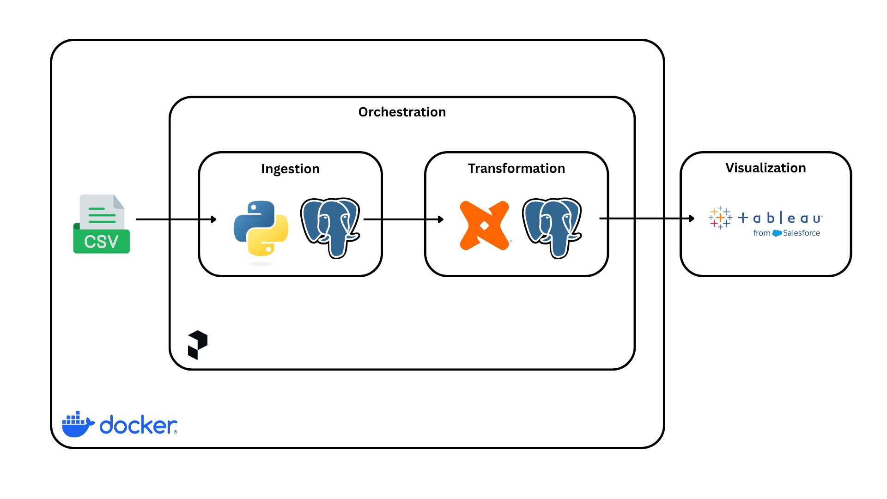
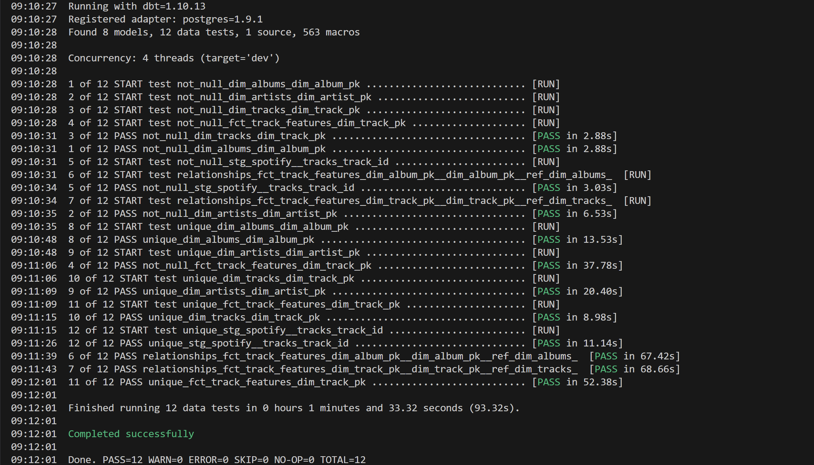
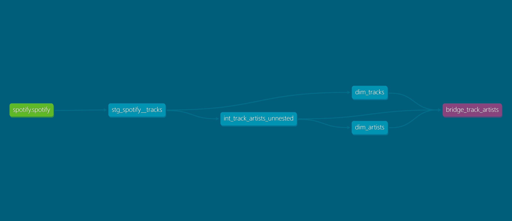
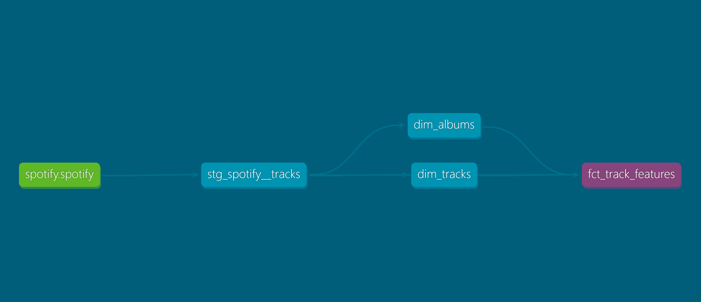
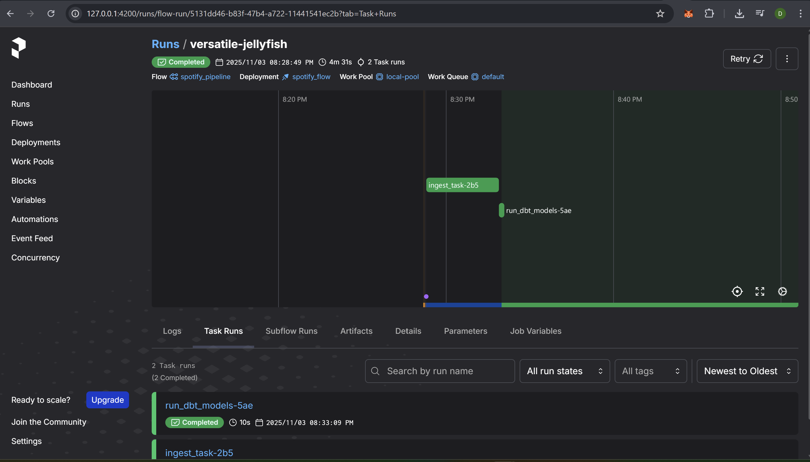
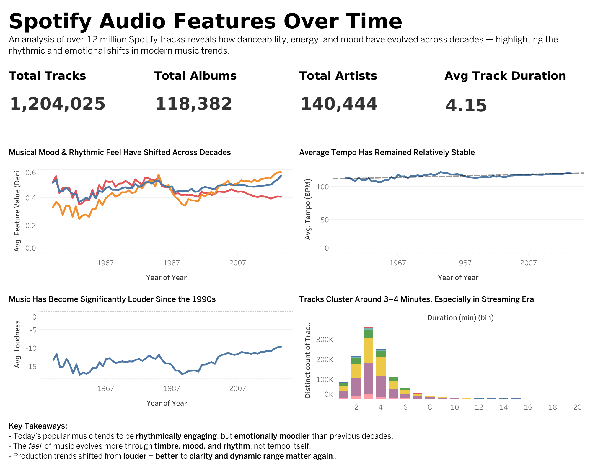

# 🎵 Spotify Audio Features Over Time
Tools: Python, PostgreSQL, dbt, Prefect, Docker, Tableau

## 🧩 Project Overview
This project analyzes how audio features such as danceability, energy, and valence influence evolved across time.
Using a dataset of over 1.2 million songs from Kaggle, the project demonstrates a modern data engineering pipeline — from raw ingestion to analytical insights.

## 🎯 Problem Statement
Understanding how musical characteristics evolve over time helps artists, producers, and industry strategists identify changes in listening trends and creative styles. Rather than focusing on popularity, this project explores how the core audio features of modern music — including danceability, energy, emotional valence, loudness, and tempo — have shifted across decades. These trends highlight broader cultural and production shifts in music, from analog to digital eras and from physical albums to streaming-first listening behaviors.

## 📚 Dataset
[Kaggle: Spotify 12M Songs](https://www.kaggle.com/datasets/rodolfofigueroa/spotify-12m-songs)
Contains over 12 million tracks with 16+ feature columns including danceability, tempo, energy, and popularity.

Download dataset using this code:
```
wget https://path-to-kaggle-dataset/tracks_features.csv -O data/raw/tracks_features.csv
```

Or using **Kaggle API**:
```
kaggle datasets download -d rodolfofigueroa/spotify-12m-songs -p data/raw --unzip
```

# 🧰 Tech Stack
| Component | Tool |
|-----------|------|
| Language  | Python |
| Data Warehouse	| PostgreSQL |
| Transformations	| dbt |
| Orchestration	| Prefect |
| Visualization | Tableau |
| Containerization  | Docker |

## 🧱 Architecture
Kaggle Dataset → Python + PostgreSQL (Docker) → dbt Transformations → Prefect Orchestration → Tableau Dashboard



## ⚙️ Components
### 1. Data Ingestion
ingest_data.py loads the raw CSV dataset (tracks_features.csv) into a PostgreSQL database (running in Docker).
Uses chunked ingestion (100k rows) for scalability.

### 2. Data Transformation
dbt models structure the data into modular layers:
| Layer            | Model Example                                | Purpose                               |
| ---------------- | -------------------------------------------- | ------------------------------------- |
| **staging**      | `stg_spotify__tracks`                        | Clean and standardize raw data        |
| **intermediate** | `int_track_artists_unnested`                 | Normalize the artist data             |
| **marts**        | `bridge_track_artists`, `dim_albums`,        | Analytical models for dashboards      |
|                  | `dim_artists`, `dim_tracks`,                 |                                       |
|                  | `fct_track_features`                         |                                       |

**dbt test**
dbt test run successfully.


**Data Lineage**
The following diagram shows how raw Spotify data flows through dbt models —from staging to marts layers.



**dbt docs**
Explore the full dbt documentation and lineage graph [here](https://dbt-docs.netlify.app/)

### 3. Orchestration and Monitoring
- Prefect orchestrates the ingestion + dbt transformation pipeline: flow.py triggers ingestion, dbt run, and validation tasks.
- Deployment created via:
``` 
prefect deployment build src/flow.py:spotify_flow -n spotify_pipeline
prefect deploy spotify_pipeline
prefect worker start --pool local-pool
prefect deployment run "spotify_pipeline/spotify_flow"
```

Prefect orchestration successfully running the Spotify → dbt pipeline with two task runs monitored in real-time.


### 4. Data Warehouse
- PostgreSQL acts as the local DWH.
- dbt handles schema creation, materialization, and query optimization.

### 5. Dashboard
Built with Tableau to visualize:
    - Correlation between track popularity and feature metrics
    - Top 10 features influencing popularity
    - Popularity distribution by genre, year, and artist


## 🧠 Future Enhancements
- Deploy PostgreSQL & dbt to the cloud (GCP BigQuery) using Terraform
- Add CI/CD using GitHub Actions

## 🚀 Reproducibility
🧩 Prerequisites
- Python 3.10+
- Docker & docker-compose
- dbt-core
- Prefect 3 CLI
- Tableau Desktop / Tableau Public

🪄 Steps to Run Locally
1️⃣ Clone the Repository
```
git clone https://github.com/deedeepratiwi/spotify-analysis.git
cd spotify-analysis
```

2️⃣ Start PostgreSQL & dbt Environment
```
docker-compose up -d
```

3️⃣ Ingest Raw Data into PostgreSQL
```
python src/ingest_data.py
```

4️⃣ Run dbt Transformations
```
dbt deps
dbt build
```

5️⃣ Orchestrate with Prefect
```
prefect deployment run "spotify_pipeline/main"
```

6️⃣ Connect Tableau to PostgreSQL
- Open Tableau → Connect → PostgreSQL
- Host: localhost
- Port: 5432
- Database: spotify
- User: postgres
- Password: postgres
- Select models: dim_tracks, fct_track_features, etc.

## 📁 Directory Structure
<pre> ```
spotify-analysis/
├── data/
│   └── raw/tracks_features.csv
├── dbt/
│   └── spotify_transform/
│       ├── models/
│       ├── target/
│       └── dbt_project.yml
├── images/
|
├── notebook/
│   └── ingest_data.ipynb
├── src/
│   ├── ingest_data.py
│   └── flow.py
├── docker-compose.yml
├── requirement.txt
└── README.md
``` </pre>

## 📊 Key Insights
The Tableau dashboard visualizes how key audio features changed between 1951–2020, including:
| Insight Area       | Metric                                             |
| ------------------ | -------------------------------------------------- |
| Track Feel & Mood  | Danceability, Energy, Valence (0–1 Audio Features) |
| Production Trends  | Loudness & Tempo Over Time                         |
| Listening Behavior | Distribution of Song Durations                     |

The dashboard highlights:
- Danceability and energy have risen steadily, reflecting the rise of rhythm-forward production in streaming-era music.
- Valence (emotion/positivity) has declined, suggesting music has trended toward more introspective or melancholic tones.
- Song loudness peaked around the late 1990s / early 2000s, aligning with the “loudness war,” then gradually stabilized.
- Track durations have shortened over time, reflecting skip-based streaming economics and TikTok-era song structure.



# 👩‍💻 Author
Diana Pratiwi
Data Analyst → aspiring Analytics Engineer
[GitHub](https://github.com/deedeepratiwi/portfolio/tree/main)
[LinkedIn](https://www.linkedin.com/in/dianapratiwi/)


